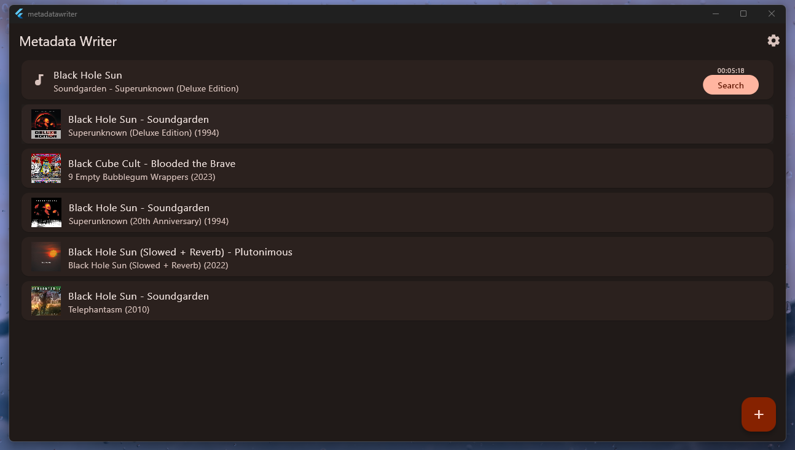

# Metadata Writer
Simple flutter program that fetches metadata from spotify and writes it to a file.

## Getting Started
1. Clone the repository
2. Run `flutter pub get` to install dependencies
3. Run `flutter run` to start the app
4. Search for the file and click on the best option.
## Features
- Fetch metadata from spotify
- Write metadata to a file
- Simple UI
- Material 3 design
- Dark mode
## Built with
- Flutter
- Dart
- Spotify API
- Material 3
## Screenshots

## TODO
- [ ] Settings page
- [ ] Image writer
- [ ] More metadata
- [ ] Bulk writing
## Contributing
Pull requests are welcome. For major changes, please open an issue first to discuss what you would like to change.

## License
[MIT](https://choosealicense.com/licenses/mit/)